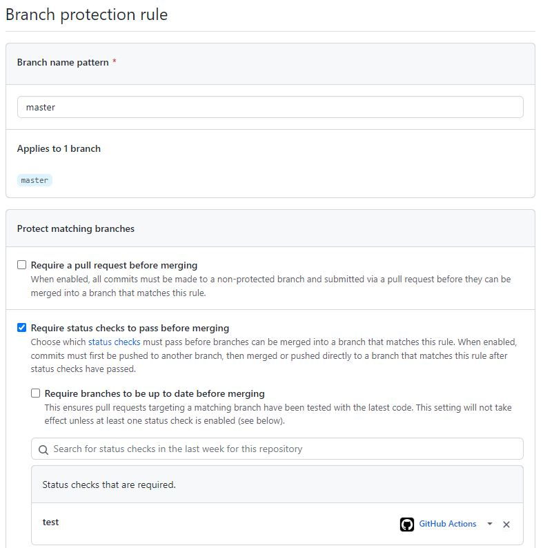

# Pre-trained Faster-Grad-CAM Demo

This repository is my attempt to create a package and a working demo from a piece of research code, as well as to set up Continuous Integration for this project.

The program itself takes images of hands as an input and displays whether these hands are open or closed. It also produces a heatmap of important regions on an image that contribute the most to the final prediction of the model using Grad-CAM approach in case of a closed hand. Go to
```
https://github.com/shinmura0/Faster-Grad-CAM
```
for the original model.

The following tutorial explains how to install the package (<b>step 2</b>) and how to set up the project for local development (<b>step 3</b>). Fulfillment of <b>step 1</b> is required for both purposes. If you want a working web demo, go to <b>step 4</b>.

# 1. Preparing virtual environment

### 1.1) Using virtualenv

This section assumes that you have Python 3.7-3.9 installed since it is required by TensorFlow. Otherwise, skip this step and go to the next one.

First, install <b>virtualenv</b> by running

```
    pip install virtualenv
```

If you have Debian/Ubuntu system, you will also have to install python3-venv by:

```
    sudo apt install python3.8-venv
```

Second, create a new virtual environment `.venv` by running

```
    python -m venv .venv
```

on Windows and

```
    python3 -m venv .venv
```

on Linux. Next, activate it:

```
    .venv/Scripts/activate
```

on Windows and

```
    . .venv/bin/activate
```

on Linux.

### 1.2) Using conda

If you did the previous step, skip this one. This section assumes you have <b>Anaconda</b> or <b>Miniconda</b> installed.

Create a new virtual environment and activate it by executing following commands:

```
    conda create -n .venv python=3.8

    conda activate .venv
```
# 2. Installing the package

If you wish just to install the package and execute its script, follow the instructions below.

## 2.1) Installing the package from a local copy

These are the instructions on how to install the package using downloaded repository on your own machine.

### 2.1.1) Downloading the code

You can either download the archive by clicking <b>Code</b>-><b>Download ZIP</b> and extract it or clone this branch using git:

```
    git clone --branch Week-3 https://github.com/471VE/Pre-trained-Faster-Grad-CAM-demo.git

    cd Pre-trained-Faster-Grad-CAM-demo
```

### 2.1.2) Building the package

You do not have to build the package yourself, since it has already been built, but if you still wish to do so, follow the instructions below. If you do not want to do it, go to the next step.

To build the package, you have to install `build` module:

```
    pip install build
```

Then you can build the package by runnung

```
    python -m build
```

on Windows and

```
    python3 -m build
```

on Linux.

### 2.1.3) Installing the package

All you have left to do is actually installing the package. Do it by running

```
    pip install dist/PreTrainedFasterGradCAMDemo-0.3.1.tar.gz
```

## 2.2) Installing the package directly from the repository

Alternatively, if you do not want to download the code, you can just execute the following command:

```
    pip install git+https://github.com/471VE/Pre-trained-Faster-Grad-CAM-demo.git@Week-3
```

## 2.3) Running the script

You can finally run the script to check whether it was installed correctly. Do it by running the following command:

```
    demo
```

# 3. Setting up the project for local development

### 3.1) Downloading the code

You can either download the archive by clicking <b>Code</b>-><b>Download ZIP</b> and extract it or clone this branch using git:

```
    git clone --branch Week-3 https://github.com/471VE/Pre-trained-Faster-Grad-CAM-demo.git

    cd Pre-trained-Faster-Grad-CAM-demo
```

### 3.2) Installing dependencies

Install the package by running the following command:
```
    pip install -e .
```
This way you create a package in editable mode, which means that if you make changes to the source folder, they will be automatically applied and you will not have to re-install the package every time.

Install ```requirements_dev.txt```:
```
    pip install -r requirements_dev.txt
```

### 3.3) Configure files (optional)

All of the files are already configured, but if you wish to change some of them, here is where settings are located for different checking tools:

- ".pre-commit-config.yaml" for ```pre-commit```;
- "pyproject.toml" for ```black``` and ```isort```;
- "setup.cfg" for ```flake8```.

### 3.4) Install git hooks

Install git hooks into your git hooks folder:
```
    pre-commit install
```

### 3.5) Running checks

Styling checks are now run automatically every time you try to commit your code. If all of the tests are successfully passed, commit process will proceed as usual. However, if some of the tests are failed, commit will not be finished. Stylistic errors will either be corrected automatically (i.e. in case of ```black```) or must be manually corrected (i.e. in case of ```flake8```). Be aware that you will have to stage changes again after failing a test.

If you want to style check your code without commiting, run

```
    pre-commit run -a
```

### 3.6) Running checks separately

Alternatively, you may choose to run the checking tools separately when needed. You can run the checks separately by executing the following commands:
```
    black .

    isort .

    flake8 .
```

### 3.7) Testing

All you have left to do is run the tests. Do it by running:
```
    pytest
```
All of the tests are located in ```tests/test_demo.py``` in case you want to take a look at them or even change them. To break regression test, you can uncomment the specified line in the definition of ```test_regression()``` function.

## CI pipeline
CI has already been set up. It will run the tests and style checks and will build a new version of package every time you push a new commit on any branch or make a pull request. Do not forget to pull the repository after a package is successfully built since it will differ from the one you commited.

To prevent a branch from being merged to ```master``` with failed tests, go to your repository, then <b>Settings->Branches->Add rule</b>. The most important setting to turn on is <b>Require status checks to pass before merging</b>. Do the rest according to the screenshots below:




Now you cannot accept pull request without tests passing.


# 4. Web Demo

## 4.1) Without setting up the project locally

For this to work, you must have <b>Docker</b> installed and running. Execute the following command:
```
    docker run -p 8501:8501 ghcr.io/471ve/pre-trained-faster-grad-cam-demo:week-3
```

You will have to wait for quite some time. When you see in the terminal that it says <i>"You can now view your Streamlit app in your browser"</i>, go to
```
    http://localhost:8501/
```
in your browser.

## 4.2) With setting up the project locally

If you completed <b>step 3</b>, all you have left to do is open the streamlit app by
```
    streamlit run src/PreTrainedFasterGradCAMDemo/app.py
```
The web page with demo should open automatically. In case it doesn't happen, go to
```
    http://localhost:8501/
```
in your browser of choice.

### 4.2.1) Building the Docker image
You may also build the docker image yourself. For this you also must have <b>Docker</b> installed and running. Run this command in the terminal:
```
    docker build -t web_demo .
```
Now you can run the docker image by
```
    docker run -p 8501:8501 web_demo
```
When you see in the terminal that it says <i>"You can now view your Streamlit app in your browser"</i>, go to
```
    http://localhost:8501/
```
in your browser.

The web demo is now working. Upload an image with a human hand in it, and the app will output whether this hand is open or closed. In case of a closed hand, it will also show a heatmap of the regions of the image that contributed the most in determining that the hand is closed.


